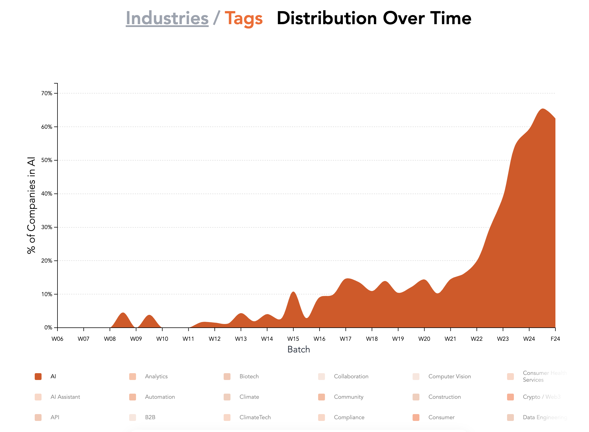
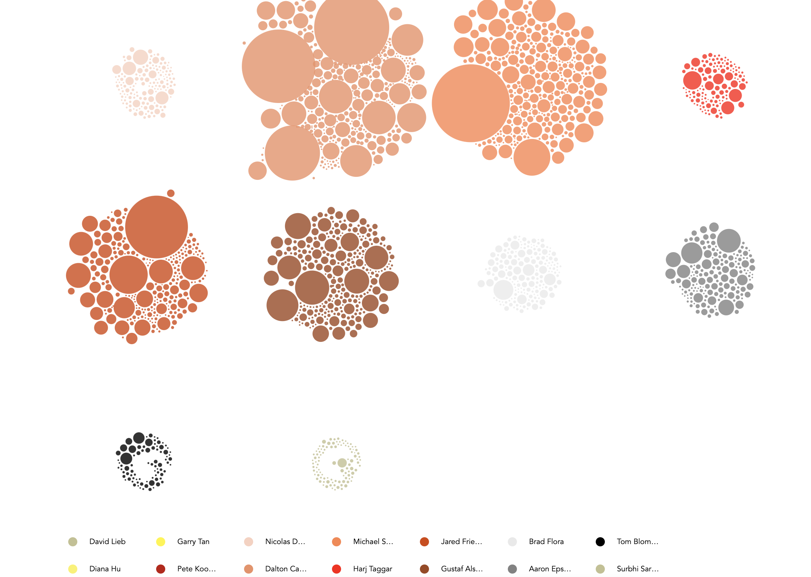
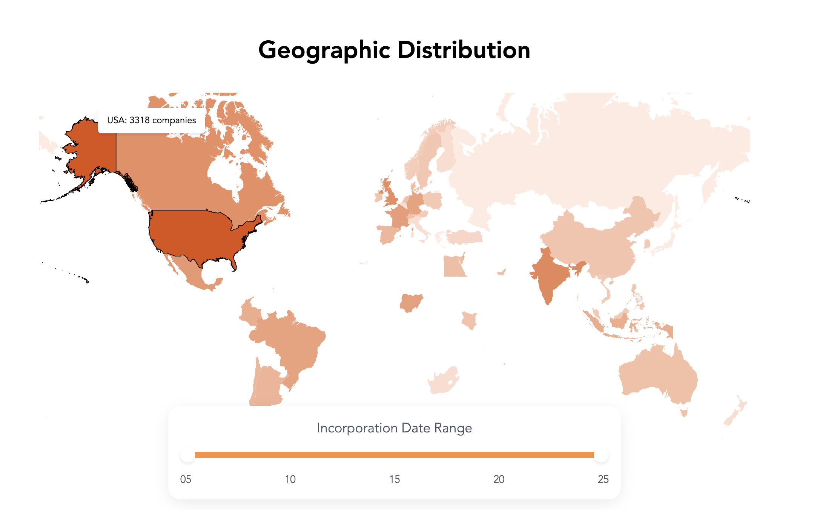

# YC Startup Visualization

An interactive visualization tool that brings Y Combinator's startup universe to life through dynamic charts and maps.

## Visualizations

### Industry Distribution Over Time

Track the evolution of YC startups across different industries and technologies.

### Partner Network Analysis

Explore the interconnected network of YC partners and their portfolio companies.

### Geographic Distribution

Discover the global reach of YC startups with our interactive heatmap.

## Features

- Geographic distribution of YC startups worldwide
- Timeline visualization of startup distribution by industry/tags
- Interactive partner network analysis
- Year range filtering (2005-2025)

## Tech Stack

- Next.js
- D3.js for data visualization
- TypeScript
- Tailwind CSS

## Getting Started

```bash
npm install
npm run dev
```

Visit `http://localhost:3000` to explore the visualizations.

## License

MIT
